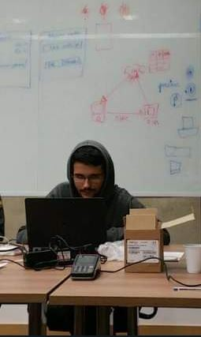

# ⭐Welcome to my Github page 🎉

- 💻 I have been a Software Engineer for 7 years, currently working with Golang at a big financial institution (1 year)

- 🏋️‍ Here you will find some APIs developed by me and some challengers to improve my skills.

- 🙌 Be free to ask me something. Suggestions are welcome.

---

Technologies which I have at least a little experience

---

